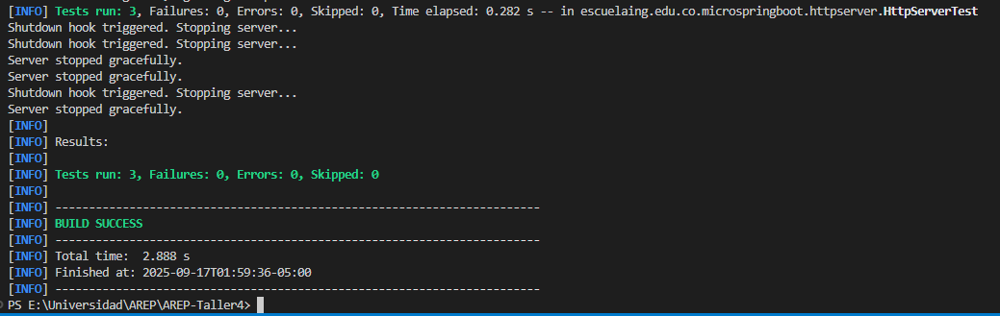

# MicroSpringBoot Framework

A lightweight Spring Boot-inspired framework implemented in Java that provides automatic component scanning, annotation-based REST endpoints, and static file serving capabilities.

## Features

- Spring-like annotations (`@RestController`, `@GetMapping`, `@RequestParam`)
- Automatic component scanning for controllers
- Static file serving with content type detection
- Query parameter extraction and handling
- Support for serving binary files (images, etc.)
- Path security (prevents directory traversal)

## Architecture

The framework is built around a lightweight HTTP server that:
1. Scans the classpath for annotated controllers.
2. Registers endpoints defined with annotations.
3. Serves static resources from the `public` directory.
4. Provides error handling and content type detection.

### Class Design

- **Annotations package**: Defines custom annotations like `@RestController`, `@GetMapping`, and `@RequestParam`.
- **HttpServer package**: Contains the server loop, request parsing, and response generation.
- **Examples package**: Demonstrates usage with sample controllers (e.g., `GreetingController`).

This separation ensures a clean architecture similar to Spring Boot, but lightweight and educational.

## Getting Started

These instructions will help you get a copy of the project up and running on your local machine for development and testing purposes.

### Prerequisites

To run this project, you need:

- Java 8 or higher
- Maven 3.6.3 or higher
- Docker (for containerization)
- Git (optional, for cloning the repository)
- AWS EC2 instance (for cloud deployment, optional)

### Installing

1. Clone the repository (or download it as a ZIP file):
```bash
git clone https://github.com/JuanEstebanMedina/AREP-Taller4.git
```

2. Navigate to the project directory:
```bash
cd AREP-Taller4
```

3. Build the project using Maven:
```bash
mvn clean install
```

## Usage

### Creating a REST Controller

```java
@RestController
public class GreetingController {

    @GetMapping("/greeting")
    public static String greeting(@RequestParam(value = "name", defaultValue = "World") String name) {
        return "Hello " + name;
    }
}
```

### Starting the Server

```java
public class MicroSpringBoot {
    public static void main(String[] args) throws IOException, URISyntaxException {
        System.out.println("Starting MicroSpringBoot:");
        HttpServer.runServer(getPort());
    }

    private static int getPort() {
        if (System.getenv("PORT") != null) {
            return Integer.parseInt(System.getenv("PORT"));
        }
        return 9000;
    }
}
```

The framework will automatically:
1. Scan for classes annotated with `@RestController`
2. Register methods annotated with `@GetMapping`
3. Handle request parameters using `@RequestParam`
4. Serve static files from the `public` directory

### Static Files

Place your static files in the `public` directory:
- HTML files
- CSS files
- JavaScript files
- Images (JPG, PNG, GIF, ICO)

## Project Structure

```
src/
  main/
    java/
      co.escuelaing.arep.microspringboot/
        annotations/           # Framework annotations
        httpserver/           # Core server implementation
        examples/             # Example controllers
public/                      # Static files directory
```

## API Endpoints

Access REST endpoints through the `/api` prefix:
- `http://localhost:9000/api/greeting?name=[UserName]`

Access static files directly:
- `http://localhost:9000/index.html`
- `http://localhost:9000/styles.css`
- `http://localhost:9000/img/logo.png`

## Running Tests

Execute the tests using Maven:

```bash
mvn test
```

The test suite includes:
- Controller request handling
- Static file serving
- Content type detection
- Error handling (404)



## Deployment with Docker and AWS

This section outlines how to generate Docker images and deploy the application on AWS EC2.

### Building and Running the Docker Image Locally

1. Build the Docker image:
   ```bash
   docker build --tag minispringboot .
   ```

2. Verify the image:
   ```bash
   docker images
   ```

3. Run the image in a local container:
   ```bash
   docker run -d -p 34000:6000 --name firstdockercontainer minispringboot
   ```

4. Use Docker Compose for multi-container management (optional):
   ```bash
   docker-compose up -d
   ```

5. Tag the image for pushing to a registry:
   ```bash
   docker tag minispringboot rivitas13/arep-taller4
   ```

6. Push the image to Docker Hub:
   ```bash
   docker push rivitas13/arep-taller4:latest
   ```

### Deploying to AWS EC2

1. Connect to your EC2 instance and update the system:
   ```bash
   sudo yum update -y
   sudo yum install docker
   ```

2. Start the Docker service:
   ```bash
   sudo service docker start
   ```

3. Pull the image from Docker Hub:
   ```bash
   docker pull rivitas13/arep-taller4:latest
   ```

4. Run the container on the EC2 instance:
   ```bash
   docker run -d --name minispringboot -p 42000:6000 rivitas13/arep-taller4:latest
   ```
   Alternatively:
   ```bash
   docker run -d -p 42000:6000 --name minispringboot rivitas13/arep-taller4
   ```

5. Access the application:
   - Open your browser and navigate to `http://ec2-54-145-140-230.compute-1.amazonaws.com:42000` (replace with your EC2 public IP or DNS).

### Deployment Test Video
A video demonstrating the deployment process and successful execution is available at `/resources/deploymentTest.mp4`.

## Built With

* [Java](https://www.java.com/) - Programming language
* [Maven](https://maven.apache.org/) - Dependency Management
* [JUnit 5](https://junit.org/junit5/) - Testing Framework
* [Docker](https://www.docker.com/) - Containerization
* [AWS EC2](https://aws.amazon.com/ec2/) - Cloud deployment


## Authors

* **Juan Esteban Medina** - Universidad Escuela Colombiana de Ingeniería Julio Garavito

## License

This project is licensed under the Apache License 2.0 - see the [LICENSE](LICENSE) file for details

